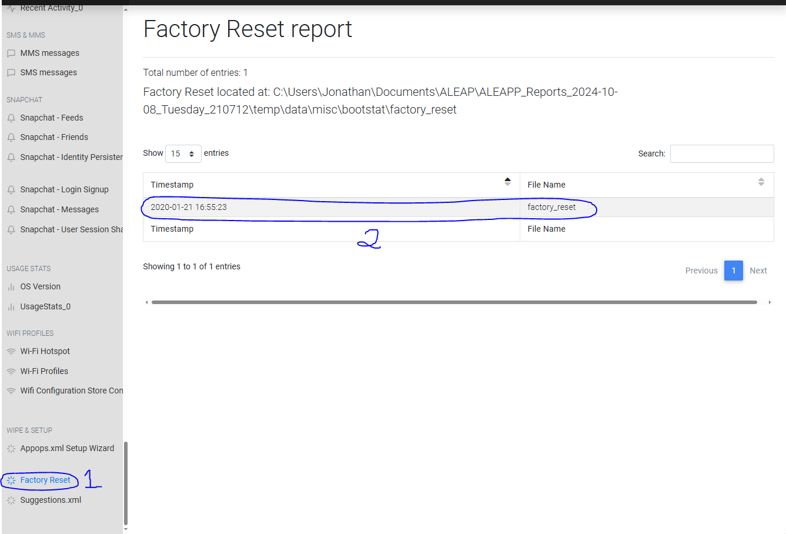
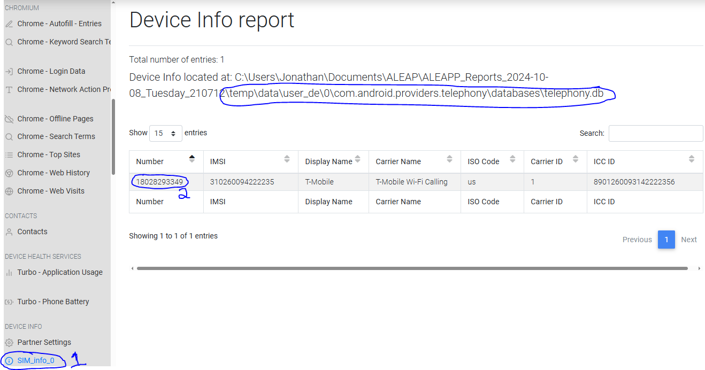
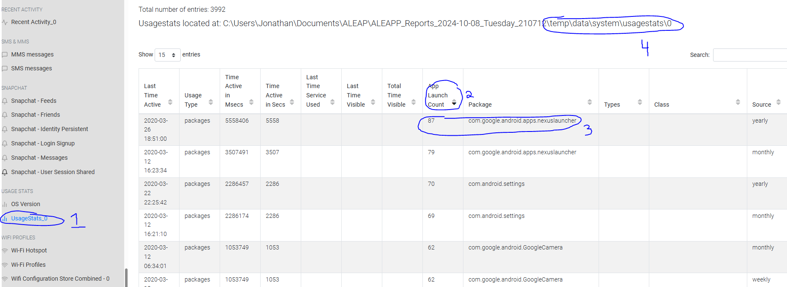
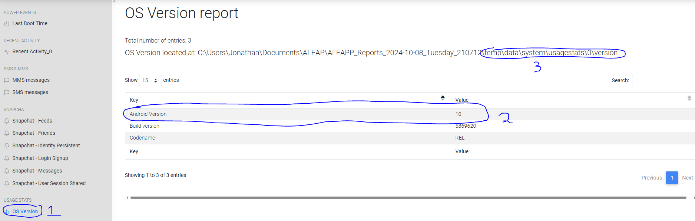
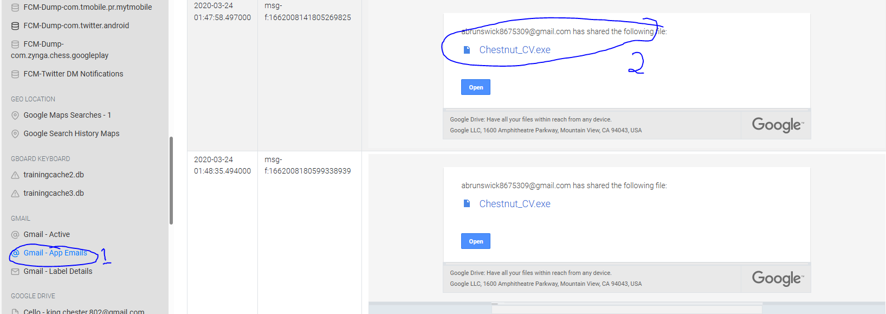
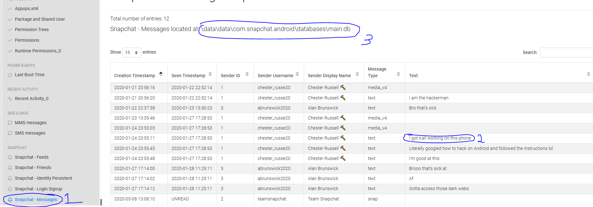
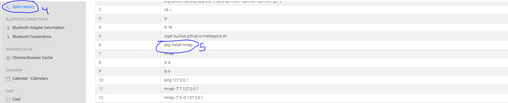
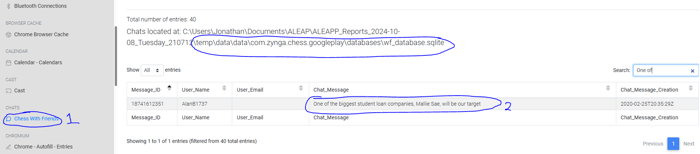
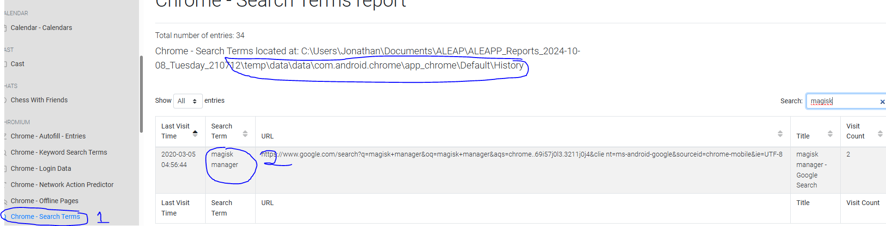
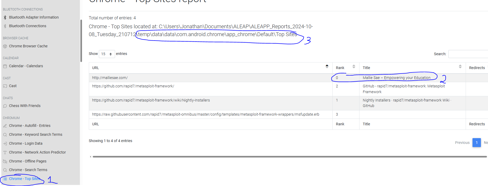

# Android Forensic Analysis — ALEAPP
**Analyst:** Henry Nguyen  
**Program:** University of Maryland — Advanced Cybersecurity Experience for Students (ACES)  
**Date Submitted:** October 8, 2024  
**Tool Used:** [ALEAPP](https://github.com/abrignoni/ALEAPP) (Android Logs Events And Protobuf Parser)

---

## Executive Summary

As a Digital Forensic Student Analyst with the University of Maryland's Advanced Cybersecurity Experience for Students, I was tasked to review and parse data belonging to an Android device image. ALEAPP was used to examine the image file its intuitive GUI and broad artifact parsing capabilities made it an essential tool for this investigation.

The objective was to examine the Android device and document evidence of a potential cyberattack conducted by the device's user. Supporting imagery is provided throughout to affirm the findings.

---

## Android Phone Analysis

### Artifact 1 — Factory Reset
**Source file:** `\temp\data\misc\bootstat\factory_reset`

**What it is:** A record of the last time the device was restored to factory settings.

**Why it matters:** A factory reset could indicate the user attempted to destroy evidence. Any data prior to the reset date is unrecoverable from this image.

*Figure 1 — The last factory reset was performed on 2020-01-21.*

---

### Artifact 2 — SIM / Telephony Database
**Source file:** `\temp\data\user_de\0\com.android.providers.telephony\databases\telephony.db`

**What it is:** A registry of the SIM card's details carrier, IMSI, MSISDN, ICC ID, and more.

**Why it matters:** This artifact identifies the specific device and provides a geographic starting point for the investigation. The phone number can also be cross-referenced with external records.

*Figure 2 — MSISDN identified as 18028293349 (T-Mobile, US).*

---

### Artifact 3 — Usage Statistics
**Source file:** `\temp\data\system\usagestats\0`

**What it is:** An overview of the user's most-utilized applications.

**Why it matters:** App usage patterns can reveal tools the attacker used. In this case, the user heavily utilized Nexus a social media aggregator app suggesting activity across multiple platforms.

*Figure 3 — The user utilized Nexus, a social media application that links multiple platforms together.*

---

### Artifact 4 — OS Version
**Source file:** `\temp\data\system\usagestats\0\version`

**What it is:** The Android OS version installed on the device.

**Why it matters:** Knowing the OS version allows an analyst to identify potential kernel or platform exploits the attacker may have leveraged (e.g., rooting/jailbreaking techniques specific to that version).

*Figure 4 — Version ID 10, representing Android 10 (the 17th major Android release).*

---

### Artifact 5 — Gmail Database (bigTopDataDB)
**Source file:** `\data\data\com.google.android.gm\databases\bigTopDataDB.1206044692`

**What it is:** An SQLite database for Google's mailing services, containing a record of emails received by the user.

**Why it matters:** Email is a primary delivery vector for malware. In this case, we identified a suspicious file transferred from Alan to Chester via email and confirmed its presence in Google Drive.

*Figure 5 — The malicious file `Chestnut_CV.exe` was identified; its presence in Google Drive was also confirmed.*

---

### Artifact 6 — Snapchat Messages & Bash History
**Source files:**
- `\data\data\com.snapchat.android\databases\main.db`
- `\temp\data\data\com.termux\files\home\.bash_history`

**What they are:**
- **main.db** — SQLite database of all Snapchat messages sent and received.
- **.bash_history** — A log of all commands executed through Termux (Android terminal emulator).

**Why they matter:** The Snapchat message exchange between Chester and Alan revealed that Kali Linux was installed on the device. The `.bash_history` file corroborated this by showing Kali Linux tools being actively executed.

*Figure 6 — Snapchat messages confirm Kali Linux was installed on the device.*

*Figure 6.1 — `.bash_history` confirms `nmap` was installed and run — a port-scanning tool native to Kali Linux.*

---

### Artifact 7 — Zynga Chess Chat (wf_database.sqlite)
**Source file:** `\temp\data\data\com.zynga.chess.googleplay\databases\wf_database.sqlite`

**What it is:** An SQLite database belonging to Zynga's Chess With Friends app, containing all in-game chat messages.

**Why it matters:** Attackers sometimes use inconspicuous platforms to communicate. This chat log revealed a direct exchange between Alan and Chester in which they identified their target.

*Figure 7 — Alan states: "One of the biggest student loan companies, Mallie Sae, will be our target."*

---

### Artifact 8 — Chrome Search History
**Source file:** `\temp\data\data\com.android.chrome\app_chrome\Default\History`

**What it is:** A log of all search terms entered in Google Chrome.

**Why it matters:** Search history reveals the user's intent and tooling. Chester searched for and downloaded Magisk Manager a popular Android rooting tool indicating an attempt to gain privileged access to the device.

*Figure 8 — Chrome search history shows a search for "magisk manager" on 2020-03-05.*

---

### Artifact 9 — Chrome Top Sites
**Source file:** `\temp\data\data\com.android.chrome\app_chrome\Default\Top Sites`

**What it is:** An SQLite database of the user's most-visited websites in Chrome.

**Why it matters:** Chester's most visited site was `malliesae.com` the very target he and Alan discussed attacking. This strongly suggests he was performing active reconnaissance on the target prior to the attack. Notably, Metasploit Framework pages also appear in the top sites list.

*Figure 9 — `malliesae.com` is ranked #0 (most visited), with Metasploit Framework pages also present.*

---

## Conclusion

Using ALEAPP, a comprehensive case was built against Chester (primary actor) and Alan (co-conspirator). Across nine artifact categories, the investigation established:

| Finding | Evidence Source |
|---|---|
| Device identity & carrier | `telephony.db` |
| Evidence of data destruction attempt | `factory_reset` |
| Malware delivery vector | `bigTopDataDB` (Gmail) |
| Communication & planning between attackers | `main.db` (Snapchat), `wf_database.sqlite` (Zynga Chess) |
| Attack tooling (Kali Linux, nmap) | `.bash_history` |
| Privilege escalation tool (Magisk) | Chrome Search History |
| Active reconnaissance on target | Chrome Top Sites |

ALEAPP proved to be an indispensable forensic tool its ability to parse a wide range of Android artifacts into a clean HTML report allowed for rapid triage and thorough documentation of the attacker's actions from beginning to end.

---

## Works Cited

Epifani, M. (2024, February 11). *A first look at Android 14 forensics.* https://blog.digital-forensics.it/2024/01/a-first-look-at-android-14-forensics.html

Magisk Manager. (2021, March 8). *Download Magisk manager latest version 27.0 for Android 2024.* https://magiskmanager.com/
