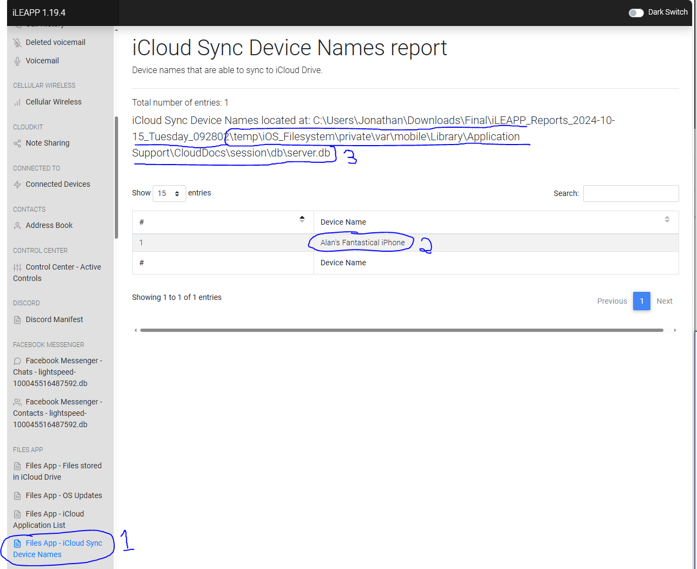
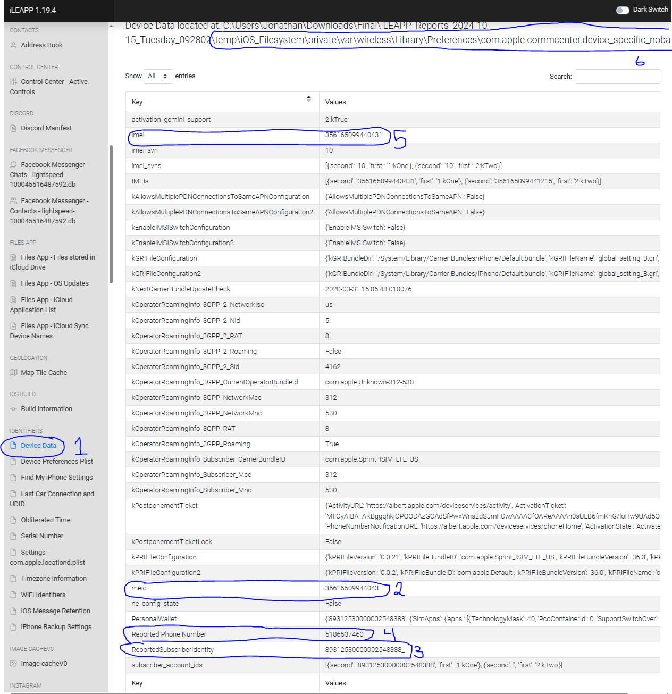
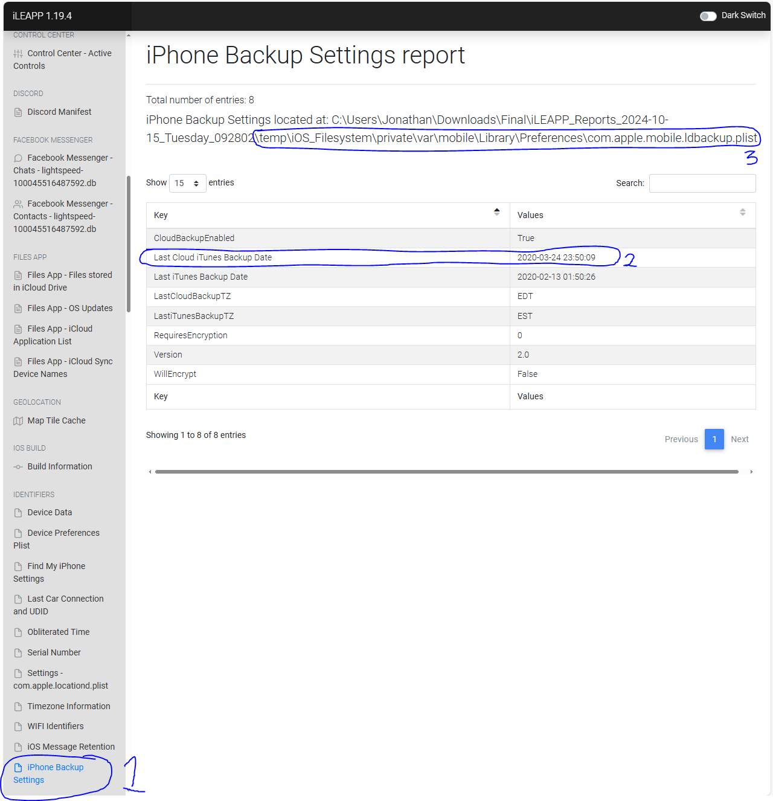
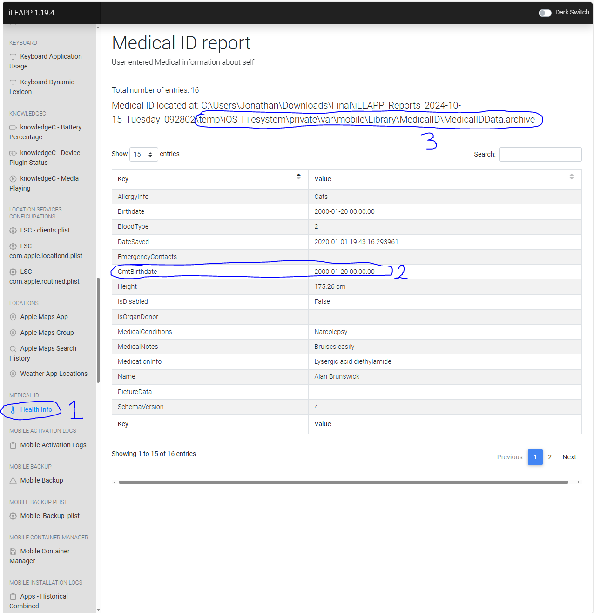
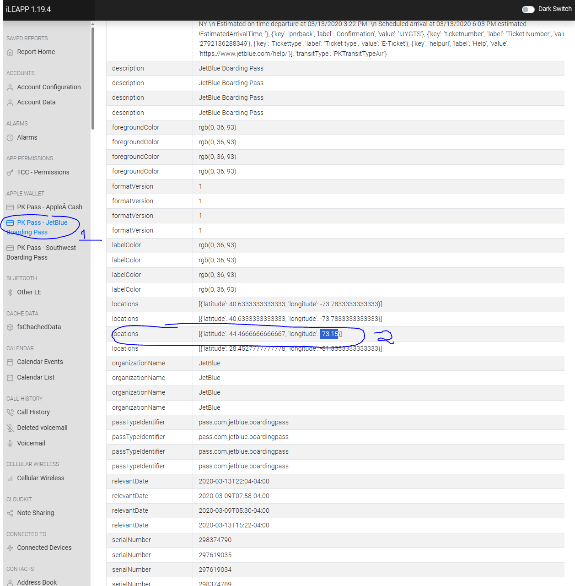
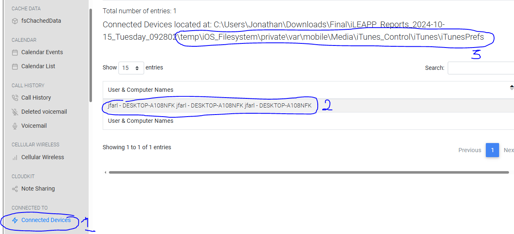
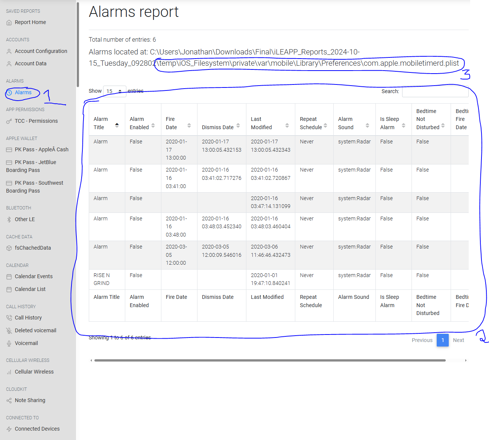
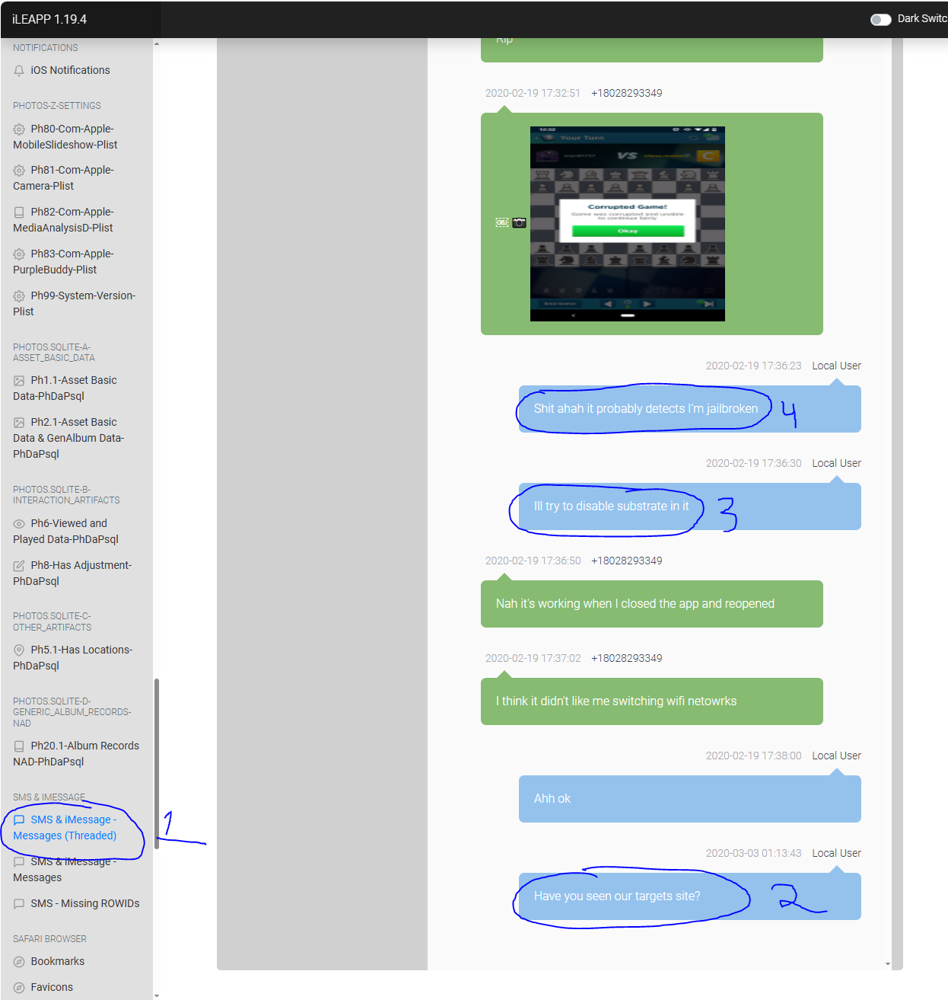
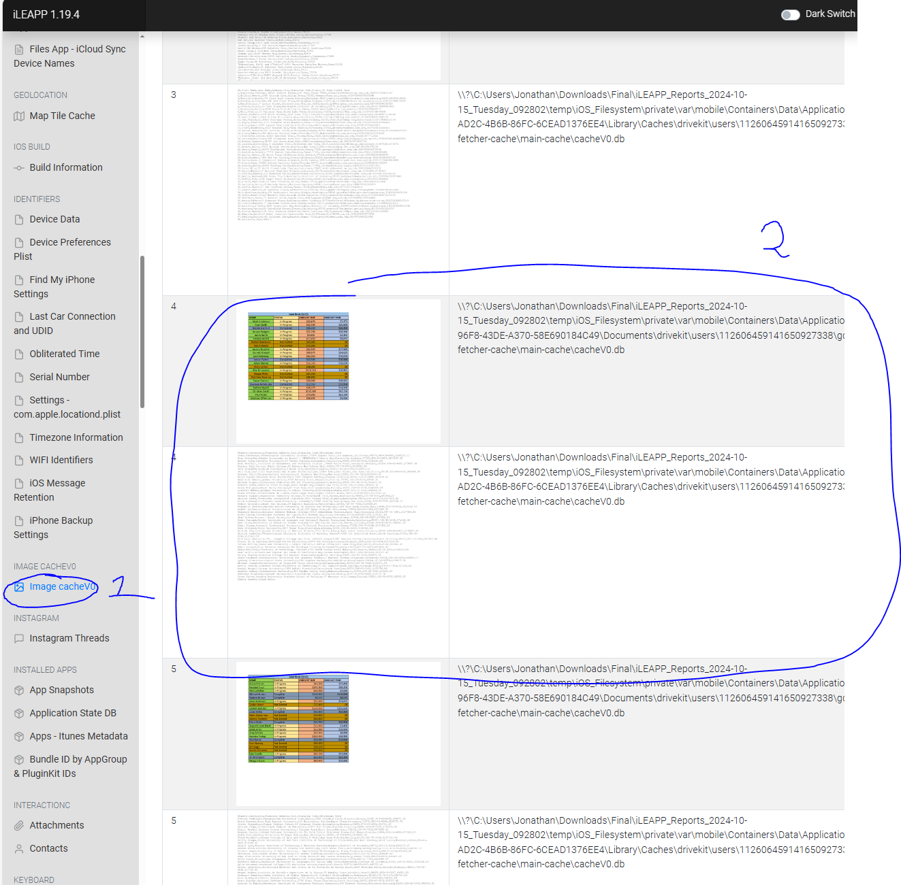

# iOS Forensic Analysis — iLEAPP
**Analyst:** Henry Nguyen  
**Program:** University of Maryland — Advanced Cybersecurity Experience for Students (ACES)  
**Date Submitted:** October 15, 2024  
**Tool Used:** [iLEAPP](https://github.com/abrignoni/iLEAPP) (iOS Logs, Events, And Plists Parser)

---

## Executive Summary

As a Digital Forensic Student Analyst studying under Professor Johnson, I was tasked with investigating an iPhone image linked to a recent cyberattack on a student financial loan institution. The device belonged to an apprehended suspect. Given that the police force handling this case lacked the expertise to parse iOS devices, we were brought in to conduct the analysis using iLEAPP.

iLEAPP's ability to parse iOS file structures — including plists, SQLite databases, and proprietary Apple formats — made it an essential tool for extracting actionable intelligence from this device.

---

## iOS Phone Analysis

### Artifact 1 — iCloud Sync Device Names (server.db)
**Source file:** `\temp\iOS_Filesystem\private\var\mobile\Library\Application Support\CloudDocs\session\db\server.db`

**What it is:** A database associated with iCloud account syncing that records all devices linked to the iCloud account.

**Why it matters:** This artifact helps establish the full scope of the suspect's digital footprint. Confirming how many devices are synced tells us where else evidence may reside. In this case, only one device was identified: **Alan's Fantastical iPhone**.

*Figure 1 — Only one device synced to this iCloud account, confirmed under "Account Data" and "Device Preferences."*

---

### Artifact 2 — SIM & Device Identifiers (commcenter plist)
**Source file:** `\temp\iOS_Filesystem\private\var\wireless\Library\Preferences\com.apple.commcenter.device_specific_nobackup.plist`

**What it is:** A property list (XML key-value format) storing device-specific wireless configuration, including SIM card and cellular identity data.

**Why it matters:** These unique identifiers — IMSI, ICCID, phone number, and device serial — allow investigators to tie the device to a specific individual, cross-reference call logs, SMS records, and carrier data, and build a full device profile.

*Figure 2 — Various identifying information for the device and SIM card.*

---

### Artifact 3 — iTunes Backup Settings (ldbackup plist)
**Source file:** `\temp\iOS_Filesystem\private\var\mobile\Library\Preferences\com.apple.mobile.ldbackup.plist`

**What it is:** A plist recording iTunes version and backup history, including the timestamp of the last backup.

**Why it matters:** Backup timestamps help establish a timeline and indicate what data may or may not have been preserved. Gaps between the backup date and device seizure could mean evidence was never backed up — or was intentionally not backed up.

*Figure 3 — Last backup was made on 2020-03-24 at 23:50:09.*

---

### Artifact 4 — Medical ID (MedicalIDData.archive)
**Source file:** `\temp\iOS_Filesystem\private\var\mobile\Library\MedicalID\MedicalIDData.archive`

**What it is:** A serialized archive of the user's Medical ID — personal health and identification data stored on the iPhone.

**Why it matters:** This artifact provides direct personal identification of the suspect, including date of birth and health details. This information may also be useful for accessing other accounts or systems, as individuals commonly use birthdates as passcodes or security question answers.

*Figure 4 — Suspect's date of birth identified as January 20, 2000.*

---

### Artifact 5 — Flight Pass Data (pass.json)
**Source file:** `\temp\iOS_Filesystem\private\var\mobile\Library\Passes\Cards\ex8l7ZF9n+CLlt8OQJA7WnwUYaQ=.pkpass\pass.json`

**What it is:** A JSON-formatted Wallet pass containing flight itinerary data — departure location, stops, and final destination.

**Why it matters:** Travel records allow investigators to construct an alibi or timeline of the suspect's physical whereabouts. This is especially relevant for correlating the timing of the cyberattack with the suspect's location.

*Figure 5 — Flight itinerary shows the user traveled Florida → New York → Vermont.*

---

### Artifact 6 — Connected Devices (iTunesPrefs)
**Source file:** `\temp\iOS_Filesystem\private\var\mobile\Media\iTunes_Control\iTunes\iTunesPrefs`

**What it is:** An iTunes preferences file recording the user and computer names of devices previously authorized to sync with this iPhone.

**Why it matters:** Identifying connected computers can lead investigators to additional evidence sources. The computer identified here — `jfarl - DESKTOP-A108NFK` — may contain synchronized data, backups, or other forensic artifacts relevant to the investigation.

*Figure 6 — The iPhone was connected and authorized to sync with desktop `jfarl - DESKTOP-A108NFK`.*

---

### Artifact 7 — Alarm Data (mobiletimerd plist)
**Source file:** `\temp\iOS_Filesystem\private\var\mobile\Library\Preferences\com.apple.mobiletimerd.plist`

**What it is:** A plist containing all alarms set by the user, including timestamps, recurrence, and enabled/disabled state.

**Why it matters:** Alarm schedules can reveal significant dates or times in an attacker's plan — recurring alarms at unusual hours may correspond to scheduled attack windows or check-in times with co-conspirators.

*Figure 7 — The user set multiple alarms; timestamps may correspond to significant operational dates.*

---

### Artifact 8 — SMS Messages (sms.db)
**Source file:** `\temp\iOS_Filesystem\private\var\mobile\Library\SMS\sms.db`

**What it is:** An SQLite database containing all SMS and iMessage conversations on the iPhone.

**Why it matters:** Direct messaging is one of the most valuable artifact categories in any investigation. In this case, the SMS database revealed conversations discussing hacking activity, attempts to jailbreak the iPhone using Substrate, and deliberation about selecting a target — directly linking the suspect to the cyberattack.

*Figure 8 — SMS conversations reference hacking, jailbreaking via Substrate, and planning around a target.*

---

### Artifact 9 — Image Cache (cacheV0.db)
**Source file:** `\private\var\mobile\Containers\Data\Application\F18BB20F-AD2C-4B6B-86FC-6CEAD1376EE4\Library\Caches\drivekit\users\112606459141650927338\image-fetcher-cache\main-cache\cacheV0.db`

**What it is:** A database caching images transmitted through chat logs — essentially a record of all images sent or received by the user via messaging apps.

**Why it matters:** The cached images recovered here contained private personal information belonging to multiple individuals, including student loan debt records and associated names — data the suspect had no legitimate reason to possess. This constitutes strong evidence of data exfiltration from the targeted institution.

*Figure 9 — Cached images contained private records including names, SSNs, and student loan debt details belonging to third parties.*

---

## Conclusion

Using iLEAPP, a comprehensive profile of the suspect was built from nine distinct artifact categories. The investigation yielded:

| Finding | Evidence Source |
|---|---|
| Device identity (Alan's Fantastical iPhone) | `server.db` (iCloud sync) |
| SIM & hardware identifiers | `commcenter plist` |
| Backup timeline | `ldbackup plist` |
| Suspect PII (DOB: Jan 20, 2000) | `MedicalIDData.archive` |
| Suspect travel itinerary (FL → NY → VT) | `pass.json` |
| Connected computer (`jfarl - DESKTOP-A108NFK`) | `iTunesPrefs` |
| Scheduled alarm patterns | `mobiletimerd plist` |
| Hacking, jailbreak, and target planning comms | `sms.db` |
| Exfiltrated private financial records | `cacheV0.db` |

iLEAPP proved especially valuable given Apple's well-known resistance to cooperating with law enforcement investigations. The tool's ability to parse iOS-specific formats — plists, archive files, and Wallet passes — provided insight that would otherwise be inaccessible. This lab also reinforced familiarity with the iOS file system structure and the breadth of forensically relevant data it contains.

---

## Works Cited

Apple. (n.d.). *Mac OS X 10.9 artifacts location.* https://forensics.wiki/mac_os_x_10.9_artifacts_location/

Charpentier, H. (2024, February 7). *What is cacheV0.db and why are there only images in it?* https://abrignoni.blogspot.com/2024/02/what-is-cachev0db-and-why-are-there.html

Edwards, B. (2022, July 31). *What is a plist file?* How-To Geek. https://www.howtogeek.com/815297/what-is-a-plist-file/

Lenovo. (n.d.). *What is archive? The benefits of archiving and file security.* https://www.lenovo.com/us/en/glossary/what-is-alt-archive/
